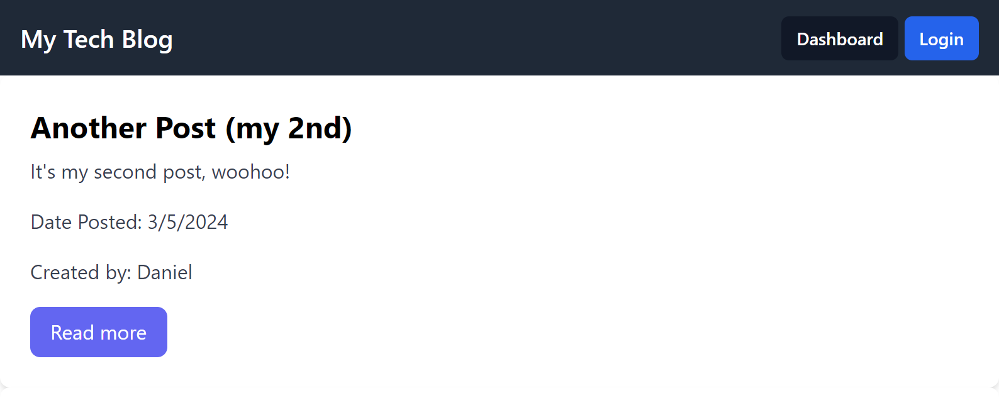

# Tech Blog 📝

Welcome to the Tech Blog - your go-to platform for the latest insights, discussions, and commentary on the tech industry.

## Table of Contents 📚
- [Introduction](#introduction)
- [Features](#features)
- [Installation](#installation)
- [Usage](#usage)
- [Support](#support)
- [License](#license)

## Introduction 🌟
This tech blog platform allows users to create, edit, view, and delete posts on various technology-related topics. Engage with the community by leaving comments, sharing your thoughts, and contributing to the tech dialogue!

## Features 🎨
- **User Authentication**: Sign up and log in to manage your posts and interact with the community.
- **CRUD Operations**: Create, Read, Update, and Delete posts with ease.
- 💬 **Comments**: Add comments to posts to engage with authors and other readers.

## Installation 💽
To get started with your own instance of Tech Blog, clone the repository and install the required dependencies.
```
git clone https://github.com/Index-al/tech-blog
cd tech-blog
npm install
```

## Usage 🚀
Start the server and navigate to the provided localhost URL in your browser.
```
npm start
```

## Preview 🖼️


## Live Demo 🌐
You can check out a fully deployed version of the site [here](https://tech-blog-0-60bb19dce57f.herokuapp.com/).

## License 📜
This project is released under the [MIT License](LICENSE).